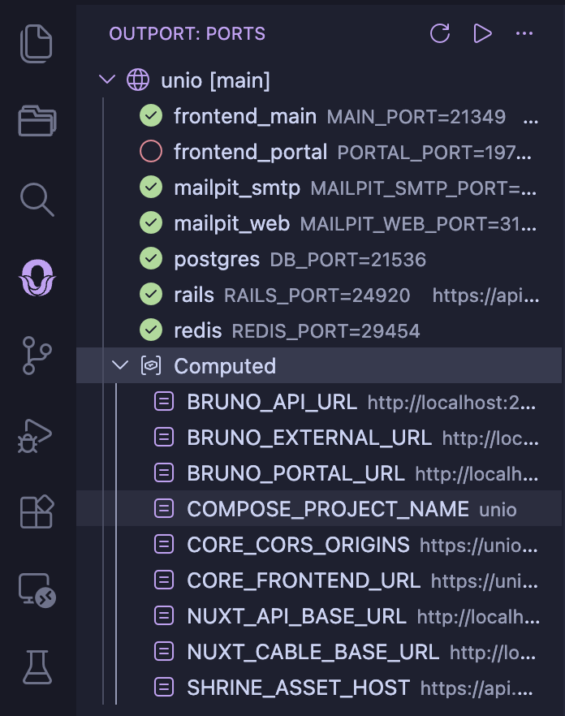

<p align="center">
  <a href="https://outport.app">
    
  </a>
</p>

# Outport for VS Code

**See your [Outport](https://outport.app) ports, URLs, and service health right in VS Code.**

<p align="center">
  
</p>

## Features

- **Sidebar panel** — Services, ports, URLs, and health indicators in the Activity Bar
- **Clickable URLs** — Click any HTTP service to open it in your browser
- **Copy to clipboard** — Right-click to copy ports, URLs, or env var assignments
- **Status bar** — Shows your project name and instance at a glance
- **Config authoring** — Autocomplete and validation for `.outport.yml`
- **Auto-refresh** — Sidebar updates when you run `outport up` or `outport down`, or when external changes are detected

## Requirements

- [Outport CLI](https://outport.app) installed and on your `$PATH`
- [YAML extension](https://marketplace.visualstudio.com/items?itemName=redhat.vscode-yaml) for config authoring features

## Commands

All commands are available from the Command Palette (Cmd+Shift+P):

| Command | Description |
|---------|-------------|
| **Outport: Run Up** | Allocate ports and write `.env` files |
| **Outport: Run Up --force** | Re-allocate all ports from scratch |
| **Outport: Run Down** | Remove project from registry and clean `.env` files |
| **Outport: Refresh** | Refresh the sidebar panel |

## Settings

| Setting | Default | Description |
|---------|---------|-------------|
| `outport.binaryPath` | `outport` | Path to the outport binary |

## Development

```bash
npm install           # Install dependencies
```

Then press F5 in VS Code to launch the Extension Development Host.

## License

MIT
